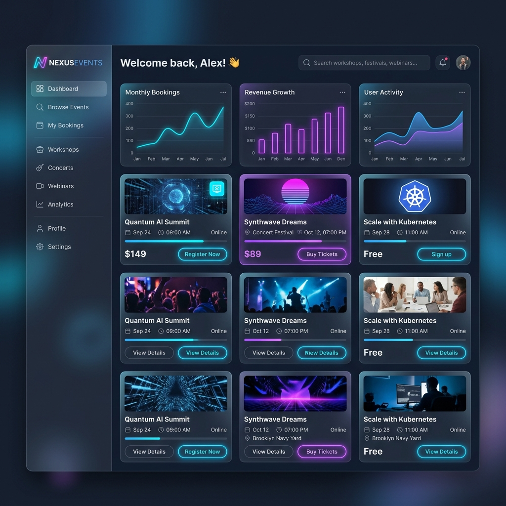

# NexusEvents | Event Booking Platform

[](https://github.com/yourusername/capstone-project/actions)
[](https://github.com/yourusername/capstone-project/actions)

NexusEvents is a premium, full-stack event exploration and seat booking platform. It features an interactive, high-performance dark-themed React dashboard alongside a robust transactional Express/TypeScript API backed by PostgreSQL. The platform implements secure JWT cookie auth, seat allocation checks in database transactions, winston structured logging, and automated container orchestration.



---

## 3-Tier Architecture Diagram

The system separates its static frontend, rest application server, and relational database layer into distinct docker networks, running behind environment-configured URLs.

```
                  +-----------------------------------+
                  |           React SPA               |
                  |  (Vite / Tailwind / Zustand v4)   |
                  +-----------------+-----------------+
                                    |
                                    | HTTPS / JSON (Axios)
                                    v
                  +-----------------+-----------------+
                  |       Node.js / Express API       |
                  |     (TypeScript / Prisma ORM)     |
                  +-----------------+-----------------+
                                    |
                                    | TCP (SQL Queries)
                                    v
                  +-----------------+-----------------+
                  |       PostgreSQL Database         |
                  +-----------------------------------+
```

---

## Technical Stack & Features

- **Frontend**: React 18, Vite, TypeScript, TailwindCSS, TanStack Query v5, Zustand, Lucide React.
- **Backend**: Node.js, Express, TypeScript, Prisma ORM, Winston Logger, Swagger UI.
- **Security**: JWT stateless authentication (short-lived access token + HTTP-only cookie refresh token), helmet security headers, CORS origin locking, and express rate limits.
- **Robust Transactions**: DB-level transactions when booking tickets, preventing concurrent double-booking anomalies.

---

## Setup & Running Locally

### 1. Docker Compose (Recommended)
You can build and launch the entire stack—including the database, API server, and Nginx frontend—with a single command:

```bash
docker compose up --build
```

- **Frontend Application**: [http://localhost:3000](http://localhost:3000)
- **API Server & Health**: [http://localhost:4000/health](http://localhost:4000/health)
- **Interactive Swagger Docs**: [http://localhost:4000/api-docs](http://localhost:4000/api-docs)

*Note: On startup, the backend automatically runs migrations to create tables and runs the database seed script to populate sample admin, user, and event records.*

### 2. Manual Installation (Development)
If you wish to run the client and API servers separately outside of Docker containers:

#### Backend Setup
1. Create a `.env` file in the `backend/` directory (see [.env.example](file:///c:/Users/nk767/OneDrive/Desktop/Capstone%20Project/backend/.env.example)):
   ```bash
   cp backend/.env.example backend/.env
   ```
2. Install dependencies:
   ```bash
   cd backend
   npm install
   ```
3. Run Prisma schema migrations and seed database:
   ```bash
   npx prisma db push
   npx prisma db seed
   ```
4. Start development hot-reload server:
   ```bash
   npm run dev
   ```

#### Frontend Setup
1. Install dependencies:
   ```bash
   cd frontend
   npm install
   ```
2. Start local Vite server:
   ```bash
   npm run dev
   ```
   *The application will open at [http://localhost:5173](http://localhost:5173)*

---

## Seed Credentials

The database seeds with the following default accounts for testing:

- **Admin Account**:
  - Email: `admin@example.com`
  - Password: `AdminPassword123!`
- **User Account**:
  - Email: `user@example.com`
  - Password: `UserPassword123!`

---

## Testing

Backend unit and integration tests are built using Jest and Supertest. The tests use full Prisma client mock profiles, making them run extremely fast and reliably.

To execute the test suite and inspect code coverage report:

```bash
cd backend
npm run test
```

---

## Core API Endpoints Reference

All endpoints are prefixed with `/api/v1`. For interactive documentation and JSON schemas, visit `/api-docs`.

### Authentication (`/auth`)
| Method | Endpoint | Description | Auth Required |
| :--- | :--- | :--- | :--- |
| `POST` | `/auth/register` | Register a new user profile | None |
| `POST` | `/auth/login` | Login user, receives access token & sets HTTP refresh cookie | None |
| `POST` | `/auth/refresh` | Verify refresh token cookie, returns new access token | None |
| `POST` | `/auth/logout` | Clears local session and HTTP refresh cookies | None |

### Events (`/events`)
| Method | Endpoint | Description | Auth Required |
| :--- | :--- | :--- | :--- |
| `GET` | `/events` | List events with searching/pagination `?page=1&limit=6` | None |
| `GET` | `/events/:id` | Retrieve detailed profile for single event | None |
| `POST` | `/events` | Create a new event | Admin |
| `PUT` | `/events/:id` | Update event information or capacity bounds | Admin |
| `DELETE` | `/events/:id` | Hard delete an event (cascades bookings) | Admin |

### Bookings (`/bookings`)
| Method | Endpoint | Description | Auth Required |
| :--- | :--- | :--- | :--- |
| `POST` | `/bookings` | Book tickets for an event. Triggers capacity transactions | User / Admin |
| `GET` | `/bookings` | Retrieve user bookings (Users see own, Admins see all) | User / Admin |
| `PUT` | `/bookings/:id/cancel` | Cancel an active booking and restore seats capacity | User / Admin |

### Administration (`/admin`)
| Method | Endpoint | Description | Auth Required |
| :--- | :--- | :--- | :--- |
| `GET` | `/admin/stats` | Get analytics metrics for total bookings, revenue, and trends | Admin |

---

## Known Limitations & Future Work

- **Payment System**: Ticket purchase transactions are simulated; integrating an external payment gateway (e.g. Stripe webhook triggers) is planned.
- **Notification Services**: Ticket booking and cancellation send JSON logs; future increments will wire mailer micro-services.
- **WebSocket Feeds**: Live ticket capacity ticks use Query polling; transitioning to WebSockets would provide real-time seats telemetry.
